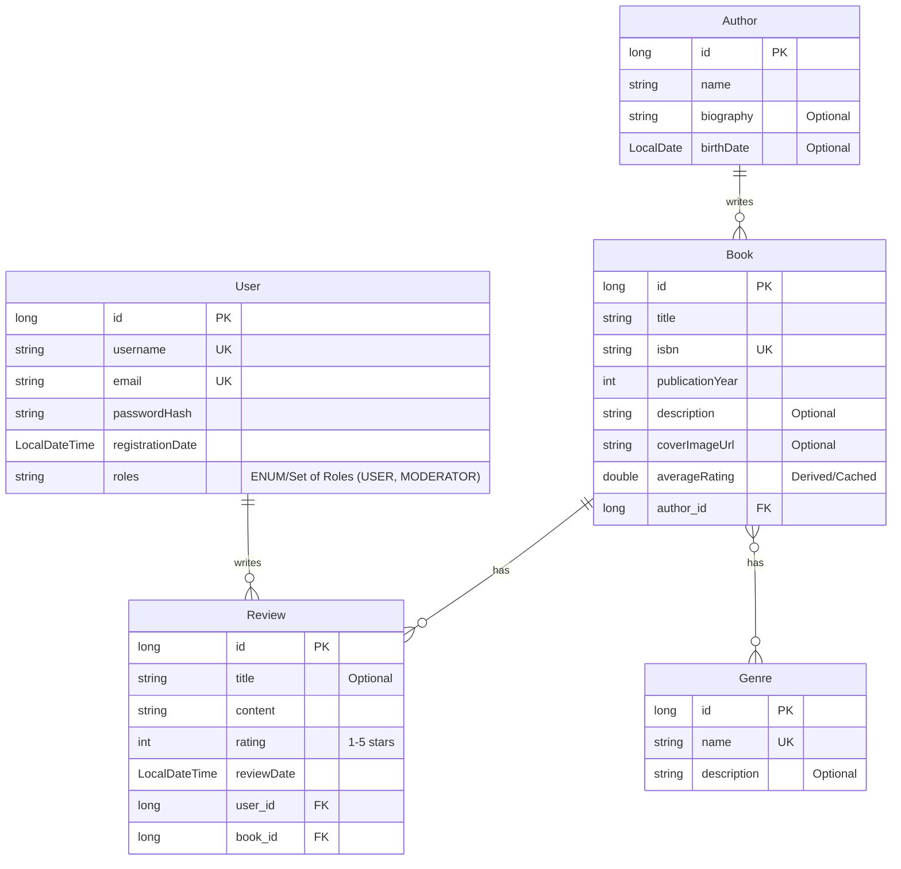

# AtomicJava

A Spring Boot backend for a peer-to-peer book review service, analogous to platforms like Letterboxd (but without following, upvotes, etc.). This project focuses on a robust data model, secure access, and high-quality implementation through comprehensive testing.

## erDiagram


## Features
- **Robust Data Model:** Normalized data model with entities like Book, Author, User, Review, and Genre, including appropriate relationships, fetch strategies, cascade behaviors, and indexes for query efficiency.
- **Role-Based Authentication & Authorization:** Secure access using Spring Security and JWT, ensuring users can only manage their own reviews and enforcing moderator/admin privileges for elevated actions.
- **RESTful API Design:** Consistent URI design, appropriate HTTP status codes, support for pagination and filtering (by author, genre, etc.), and comprehensive error handling.
- **Data Integrity:** Ensured using Spring's `@Transactional` annotations for correct transactional boundaries.
- **Comprehensive Testing:** Includes unit and integration tests for all critical services, covering edge cases and security checks.
- **CI/CD Pipeline:** Automated testing on every push and pull request using GitHub Actions to maintain code quality and prevent regressions.
- **Security Hardening:** Protection against common vulnerabilities like SQL injection and CSRF.
- **API Documentation:** Clear Swagger/OpenAPI documentation for all API endpoints.

## Tech Stack
- Java 21
- Spring Boot 3.5.3
- Spring Security (JWT)
- Hibernate (JPA)
- PostgreSQL 17.5
- Maven
- Lombok
- SpringDoc OpenAPI

## Setup

### Prerequisites
- Java Development Kit (JDK) 21
- Maven
- PostgreSQL database (version 17.5 recommended)

### Database Configuration
1.  Ensure you have a PostgreSQL instance running.
2.  Create a database named `atomicjava`.
3.  Update the database connection properties in `src/main/resources/application.properties`:
    ```properties
    spring.datasource.url=jdbc:postgresql://localhost:5432/atomicjava
    spring.datasource.username=postgres
    spring.datasource.password=root
    ```
    (Replace `localhost:5432`, `postgres`, and `root` with your PostgreSQL server details and credentials.)

4.  The application uses `spring.jpa.hibernate.ddl-auto=update`, which will automatically create/update database schemas on startup. For production, consider using Flyway or Liquibase for schema migrations.

### Running the Application
1.  **Clone the repository:**
    ```bash
    git clone <repository_url>
    cd atomicjava
    ```
2.  **Build the project:**
    ```bash
    ./mvnw clean install
    ```
3.  **Run the application:**
    ```bash
    ./mvnw spring-boot:run
    ```
    The application will start on `http://localhost:18080` (or the port configured in `application.properties`).

## Usage

### Authentication
-   **Register:** `POST /api/auth/register`
    -   Body: `{"username": "testuser", "email": "test@example.com", "password": "password123", "roles": ["USER"]}`
-   **Login:** `POST /api/auth/login`
    -   Body: `{"usernameOrEmail": "testuser", "password": "password123"}`
    -   Returns a JWT token to be used in the `Authorization: Bearer <token>` header for protected endpoints.

### API Endpoints
All API endpoints are prefixed with `/api`.

-   **Books:**
    -   `GET /api/books`: Get all books (supports pagination, filtering by `query`, `authorName`, `genreName`)
    -   `GET /api/books/{id}`: Get book by ID
    -   `POST /api/books`: Create a new book (MODERATOR/ADMIN only)
    -   `PUT /api/books/{id}`: Update an existing book (MODERATOR/ADMIN only)
    -   `DELETE /api/books/{id}`: Delete a book (MODERATOR/ADMIN only)

-   **Authors:**
    -   `GET /api/authors`: Get all authors (supports pagination)
    -   `GET /api/authors/{id}`: Get author by ID
    -   `POST /api/authors`: Create a new author (MODERATOR/ADMIN only)
    -   `PUT /api/authors/{id}`: Update an existing author (MODERATOR/ADMIN only)
    -   `DELETE /api/authors/{id}`: Delete an author (MODERATOR/ADMIN only)

-   **Genres:**
    -   `GET /api/genres`: Get all genres (supports pagination)
    -   `GET /api/genres/{id}`: Get genre by ID
    -   `POST /api/genres`: Create a new genre (MODERATOR/ADMIN only)
    -   `PUT /api/genres/{id}`: Update an existing genre (MODERATOR/ADMIN only)
    -   `DELETE /api/genres/{id}`: Delete a genre (MODERATOR/ADMIN only)

-   **Reviews:**
    -   `POST /api/reviews`: Create a new review (Authenticated users only)
    -   `GET /api/reviews/{id}`: Get review by ID
    -   `GET /api/reviews/book/{bookId}`: Get reviews for a specific book (supports pagination)
    -   `GET /api/reviews/user/{userId}`: Get reviews by a specific user (supports pagination)
    -   `PUT /api/reviews/{id}`: Update an existing review (User who created the review, MODERATOR/ADMIN only)
    -   `DELETE /api/reviews/{id}`: Delete a review (User who created the review, MODERATOR/ADMIN only)

-   **Users:**
    -   `GET /api/users`: Get all users (ADMIN only)
    -   `GET /api/users/{id}`: Get user by ID (ADMIN only)
    -   `POST /api/users`: Create a new user (ADMIN only)
    -   `PUT /api/users/{id}`: Update an existing user (ADMIN only)
    -   `DELETE /api/users/{id}`: Delete a user (ADMIN only)

## API Documentation (Swagger/OpenAPI)

Access the interactive API documentation (Swagger UI) at:
`http://localhost:18080/swagger-ui.html`

This interface allows you to explore all available endpoints, their request/response schemas, and even test them directly.

## Testing

To run all unit and integration tests:

```bash
./mvnw test
```

## CI/CD

This project includes a GitHub Actions workflow (`.github/workflows/maven.yml`) that automatically builds the project and runs tests on every `push` and `pull_request` event. This ensures code quality and helps prevent regressions.

---

### Snippets
Some of the snippets I used throughout the development process.... (will update this section)
`Populate data for Genre Table`
```sql
INSERT INTO genres (name, description) VALUES ('Fiction', 'Stories that are not factual and are instead products of the imagination.');
INSERT INTO genres (name, description) VALUES ('Fantasy', 'Involves magic, mythical creatures, or supernatural elements as a primary plot driver, theme, or setting.');
INSERT INTO genres (name, description) VALUES ('Science Fiction', 'Deals with imaginary content that is often inspired by science and technology.');
INSERT INTO genres (name, description) VALUES ('Mystery', 'Focuses on a detective or amateur sleuth who solves a crime or series of crimes.');
INSERT INTO genres (name, description) VALUES ('Thriller', 'Characterized by a sense of excitement, suspense, tension, and anticipation.');
INSERT INTO genres (name, description) VALUES ('Horror', 'Designed to frighten, scare, or startle its audience by inducing feelings of horror and terror.');
INSERT INTO genres (name, description) VALUES ('Romance', 'Focuses on the romantic relationship and intimate love between two or more characters.');
INSERT INTO genres (name, description) VALUES ('Biography', 'An account of someone''s life written by someone else.');
INSERT INTO genres (name, description) VALUES ('History', 'Focuses on past events, often with analysis and interpretation.');
INSERT INTO genres (name, description) VALUES ('Self-Help', 'Aimed at instructing its readers on how to solve personal problems or improve themselves.');
INSERT INTO genres (name, description) VALUES ('Poetry', 'A form of literature that evokes a concentrated imaginative awareness of experience or a specific emotional emotional response through language chosen and arranged for its meaning, sound, and rhythm.');
INSERT INTO genres (name, description) VALUES ('Literary Fiction', 'Character-driven stories that allow for detailed explorations of the human condition.');
```
