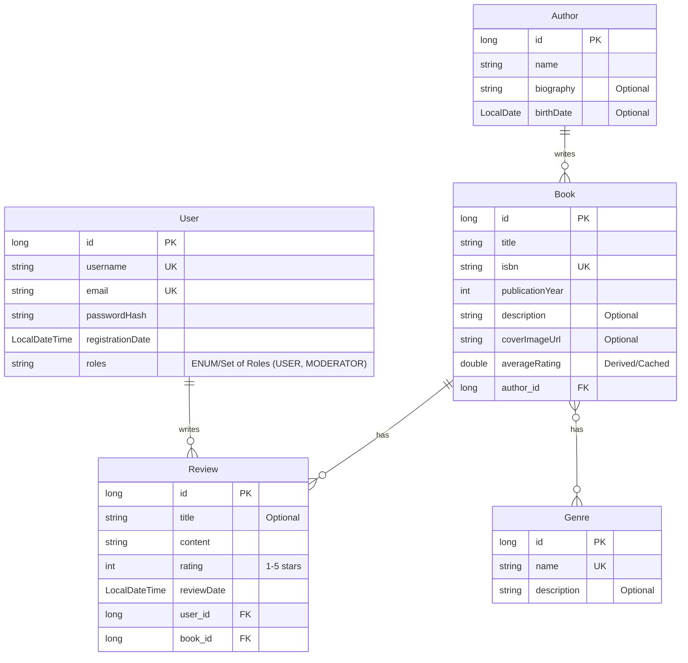

# AtomicJava
a spring backend for peer-to-peer book review service analogous to movie platform like **letterboxd** _(but without following, upvotes, etc etc)_. Independently design the data model, implemented backend services, secure access, and with high quality through testing.


## erDiagram


## Tech Stack
- Java 21
- Spring Boot 3.5.3
- PostgreSQL 17.5

---

### Snippets
Some of the snippets I used throughout the development process.... (will update this section)
`Populate data for Genre Table`
```sql
INSERT INTO genres (name, description) VALUES ('Fiction', 'Stories that are not factual and are instead products of the imagination.');
INSERT INTO genres (name, description) VALUES ('Fantasy', 'Involves magic, mythical creatures, or supernatural elements as a primary plot driver, theme, or setting.');
INSERT INTO genres (name, description) VALUES ('Science Fiction', 'Deals with imaginary content that is often inspired by science and technology.');
INSERT INTO genres (name, description) VALUES ('Mystery', 'Focuses on a detective or amateur sleuth who solves a crime or series of crimes.');
INSERT INTO genres (name, description) VALUES ('Thriller', 'Characterized by a sense of excitement, suspense, tension, and anticipation.');
INSERT INTO genres (name, description) VALUES ('Horror', 'Designed to frighten, scare, or startle its audience by inducing feelings of horror and terror.');
INSERT INTO genres (name, description) VALUES ('Romance', 'Focuses on the romantic relationship and intimate love between two or more characters.');
INSERT INTO genres (name, description) VALUES ('Biography', 'An account of someone''s life written by someone else.');
INSERT INTO genres (name, description) VALUES ('History', 'Focuses on past events, often with analysis and interpretation.');
INSERT INTO genres (name, description) VALUES ('Self-Help', 'Aimed at instructing its readers on how to solve personal problems or improve themselves.');
INSERT INTO genres (name, description) VALUES ('Poetry', 'A form of literature that evokes a concentrated imaginative awareness of experience or a specific emotional response through language chosen and arranged for its meaning, sound, and rhythm.');
INSERT INTO genres (name, description) VALUES ('Literary Fiction', 'Character-driven stories that allow for detailed explorations of the human condition.');
```
