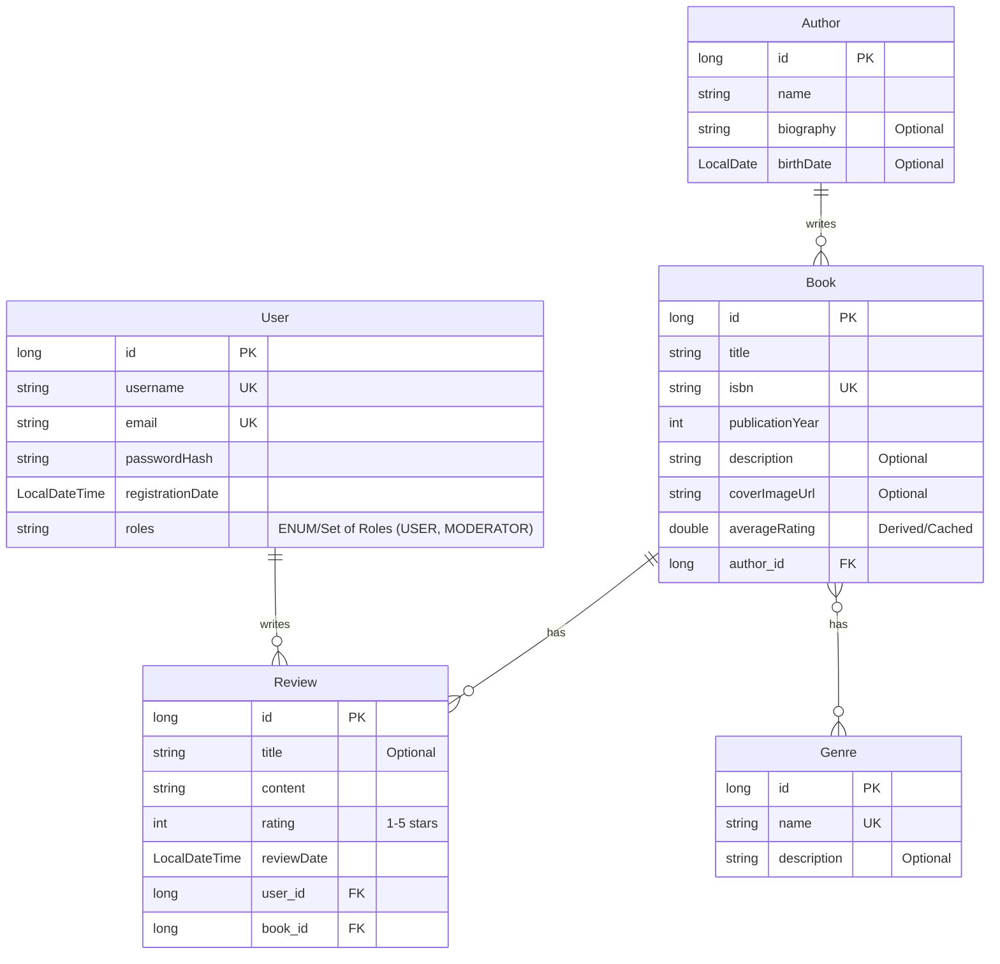

## erDiagram

```mermaid
erDiagram
    User {
        long id PK
        string username UK
        string email UK
        string passwordHash
        LocalDateTime registrationDate
        string roles "ENUM/Set of Roles (USER, MODERATOR)"
    }
    Author {
        long id PK
        string name
        string biography "Optional"
        LocalDate birthDate "Optional"
    }
    Book {
        long id PK
        string title
        string isbn UK
        int publicationYear
        string description "Optional"
        string coverImageUrl "Optional"
        double averageRating "Derived/Cached"
        long author_id FK
    }
    Review {
        long id PK
        string title "Optional"
        string content
        int rating "1-5 stars"
        LocalDateTime reviewDate
        long user_id FK
        long book_id FK
    }
    Genre {
        long id PK
        string name UK
        string description "Optional"
    }
    Author ||--o{ Book : "writes"
    Book ||--o{ Review : "has"
    User ||--o{ Review : "writes"
    Book }o--o{ Genre : "has"
```
